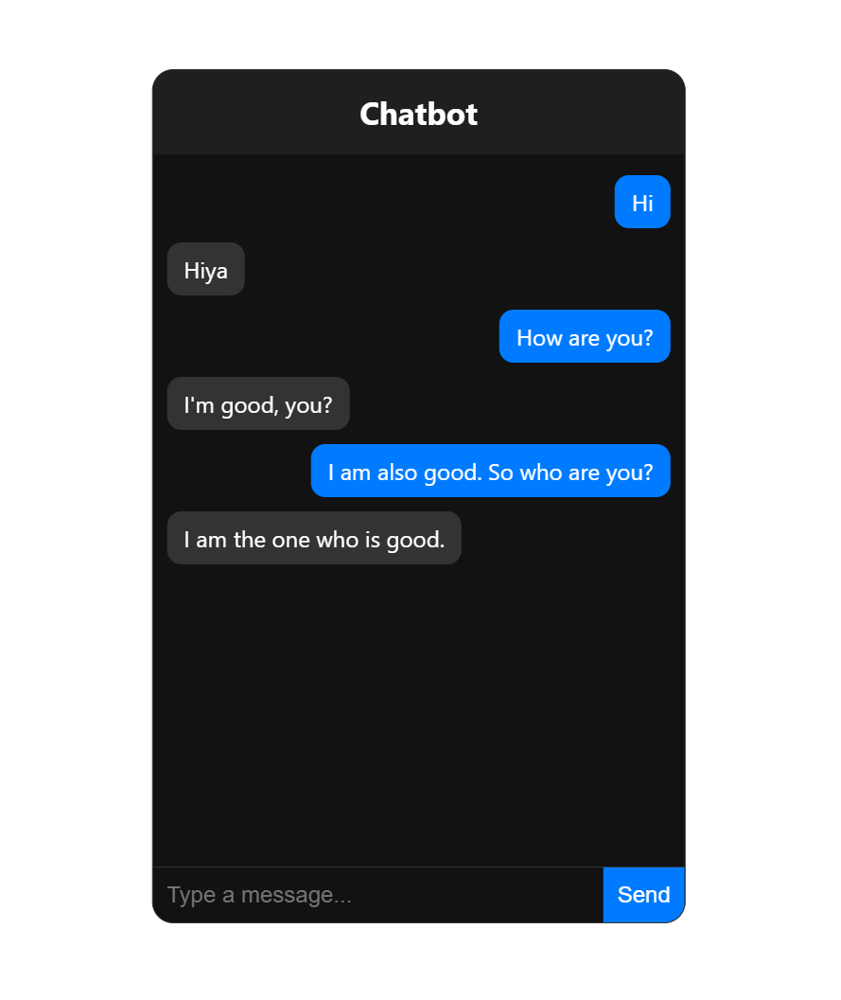

# AI Chatbot with React & Flask

This is a simple chatbot application built using React.js for the frontend and Flask for the backend. The chatbot uses a pre-trained DialoGPT model to generate responses.

---

## Features
- AI-powered chatbot using Microsoft DialoGPT
- Frontend built with React.js
- Backend built with Flask
- Handles real-time communication between user and bot
- Modern, dark-themed UI with a mobile-friendly design

---

## Screenshots



---

## Tech Stack
### Frontend (React.js)
- React.js
- HTML, CSS
- Fetch API for communication with the backend

### Backend (Flask)
- Flask
- Transformers (DialoGPT Model)
- Flask-CORS

---
## Installation & Setup

### Backend Setup
#### Step 1: Install Python dependencies
Make sure you have Python 3.8+ installed. Then install dependencies:
```sh
pip install flask flask-cors torch transformers requests
```

#### Step 2: Run the Flask Server
```sh
python app.py
```
Your backend will be live at http://127.0.0.1:5000/.

---
### Frontend Setup

#### Step 1: Install Node.js
Ensure you have Node.js (v16+) installed. Check with:
```sh
node -v
npm -v
```
If not installed, download Node.js from the official website.
#### Step 2: Install React dependencies
Navigate to the frontend directory:
```sh
cd frontend
npm install
```

#### Step 3: Start the React App
```sh
npm start
```
#### The frontend will launch at http://localhost:3000/.
---
## Testing the Chatbot API
### To test if the chatbot API is working, run:

```sh
python test_chatbot.py
```

### It should send a message and receive a response from the bot.

